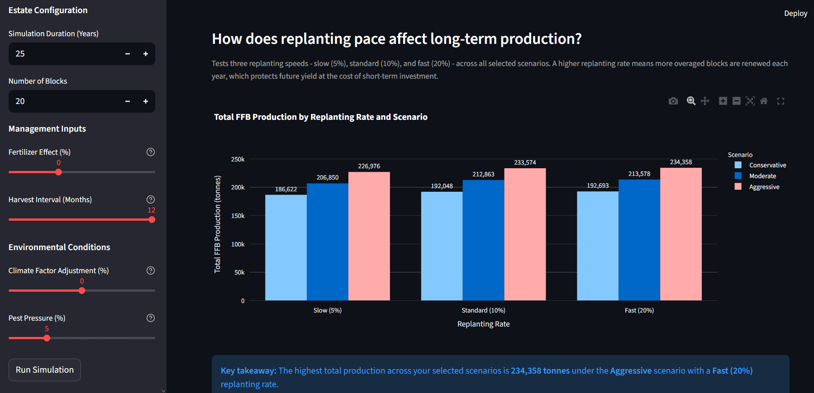
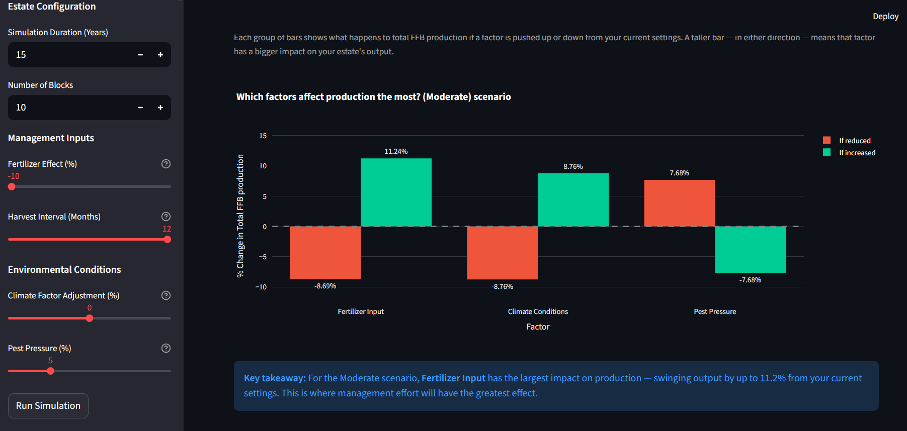

# PalmOpsSim 🌴

**A simulation-based oil palm plantation monitoring and decision-support tool.**

PalmOpsSim models how a managed oil palm estate behaves over time, allowing users to explore how decisions about replanting, fertilizer, harvesting, climate conditions, and pest management shape long-term Fresh Fruit Bunch (FFB) production — without any real-world consequences.

Built as a self-directed technical project, PalmOpsSim is designed for plantation managers, analysts, students, and anyone who wants to understand the dynamics of oil palm estate management through interactive simulation.

---

## Screenshots


*How does replanting pace affect long-term production? Slow (5%), Standard (10%), and Fast (20%) replanting rates compared across all three management scenarios over 25 years.*
<br>


*Which factors affect production the most? Red bars show the impact of reducing each factor, green bars show the impact of increasing it.*
<br>

---

## Key Features

- **Palm lifecycle modelling** — A six-stage age-yield curve from immature through to economically unproductive, reflecting real oil palm biology
- **Fertilizer response with diminishing returns** — Increasing fertilizer improves yield up to a point, but the benefit progressively decreases at higher application levels
- **Climate adjustment with age-sensitivity** — Older palms are more vulnerable to climate stress than younger ones, capturing a compounding risk often overlooked in planning
- **Pest pressure impact** — A yield reduction factor that reflects real biological constraints, including higher losses on more productive blocks
- **Harvest efficiency** — Linked directly to harvest interval; extended rounds reduce the yield actually collected
- **Realistic replanting constraints** — Only a fixed proportion of overaged blocks can be replanted each year, mirroring real operational limitations
- **Sensitivity analysis** — Tests the impact of fertilizer, climate, and pest pressure individually to identify which variable drives production outcomes most strongly
- **Estate age distribution analysis** — Reveals the structural health of the plantation at the end of the simulation, showing the balance of immature, prime, declining, and overaged blocks
- **Automated plain-English takeaways** — Every output section generates a key finding automatically, benchmarked against the Malaysian MPOB national yield average of 17 t/ha
- **Final Estate Analysis** — A combined summary verdict at the end of each simulation run

---

## How to Run

**Requirements:** Python 3.8 or above

**1. Clone the repository**
```bash
git clone https://github.com/jx-technologies/palmopsim.git
cd palmopssim
```

**2. Install dependencies**
```bash
pip install -r requirements.txt
```

**3. Launch the app**
```bash
streamlit run app.py
```

The dashboard will open in your browser automatically.

---

## Project Structure

```
palmopssim/
│
├── app.py                  # Streamlit dashboard and user interface
├── palmopsim_model.py      # Simulation engine, model logic, and analytical tools
├── requirements.txt        # Python dependencies
└── README.md
```

---

## How It Works

The simulation runs at the **plantation block level** — each group of palms is treated as a single managed unit, consistent with how real estates are organised. The model evaluates every block annually across a user-defined simulation period of up to 30 years.

At each annual step, the simulation:
1. Calculates base yield from the palm's current age using the six-stage lifecycle curve
2. Applies the scenario yield adjustment (Conservative / Moderate / Aggressive)
3. Applies the fertilizer response function with diminishing returns
4. Applies the climate adjustment factor, weighted by palm age
5. Applies per-block stochastic variation and harvest efficiency
6. Deducts pest pressure losses
7. Ages all blocks by one year and runs the constrained replanting logic

Results are aggregated into annual estate-level production totals, and all outputs are passed to the Streamlit dashboard for visualisation and interpretation.

---

## Sidebar Configuration

| Parameter | Range | Description |
|---|---|---|
| Strategy | Conservative / Moderate / Aggressive | Yield assumption and default replanting rate |
| Simulation Duration | 1 – 30 years | How many years the simulation runs |
| Number of Blocks | 1 – 50 | Size of the simulated estate |
| Fertilizer Effect | −10% to +20% | Nutrient management input; follows diminishing returns |
| Harvest Interval | 6 – 12 months | Harvesting frequency; longer intervals reduce efficiency |
| Climate Factor | −20% to +20% | Environmental conditions adjustment |
| Pest Pressure | 0% – 20% | Average yield reduction from pest and disease activity |

---

## Built With

- [Python](https://www.python.org/) — Core simulation logic
- [Streamlit](https://streamlit.io/) — Interactive web dashboard
- [Plotly](https://plotly.com/python/) — Interactive charts and visualisations
- [NumPy](https://numpy.org/) — Numerical operations and stochastic variation
- [Pandas](https://pandas.pydata.org/) — Data management and aggregation

---

## Development Phases

PalmOpsSim was developed across seven phases, each building deliberately on the one before:

| Phase | Description |
|---|---|
| Phase 0 | Domain research — oil palm biology, Malaysian yield data, plantation monitoring workflows |
| Phase 1 | Simulation framework design — variables, decision rules, synthetic data structure |
| Phase 2 | Scenario analysis — low, average, and high yield scenario thinking |
| Phase 3a | Harvest decision engine design |
| Phase 3b | Working prototype — first simulation run and output validation |
| Phase 4 | Streamlit user interface — accessible to non-technical users |
| Phase 5 | Model improvements — age-yield curve, fertilizer response, climate sensitivity, pest pressure, harvest efficiency, replanting constraints |
| Phase 6 | Analytical tools — sensitivity analysis and estate age distribution analysis |
| Phase 7 | Interpretability improvements — visual charts, plain-English labels, automated takeaways, Final Estate Analysis |

---

## Authors

**Kong Kai Mann** and **Eng Yong Xiang**
Self-Directed Technical Project — March 2026

---

## References

- Hafiz, S. (2024). *FFB Yield & Crude Palm Oil Yield of Oil Palm Estates 2024*. Malaysian Palm Oil Board (MPOB). https://bepi.mpob.gov.my/index.php/import/1180-ffb-yield-crude-palm-oil-yield-of-oil-palm-estates-2024
- Sahidan, A. S. (2021). Factors affecting fresh fruit bunch yields of independent smallholders in Sabah. *Oil Palm Industry Economic Journal, 21*(2), 22–34. https://doi.org/10.21894/opiej.2021.06
- Yeo, Y. T. (2022, May 19). *From seed to harvest: A guide to oil palm cultivation*. Musim Mas. https://www.musimmas.com/resources/blogs/what-is-palm-oil-from-seed-to-harvest/
